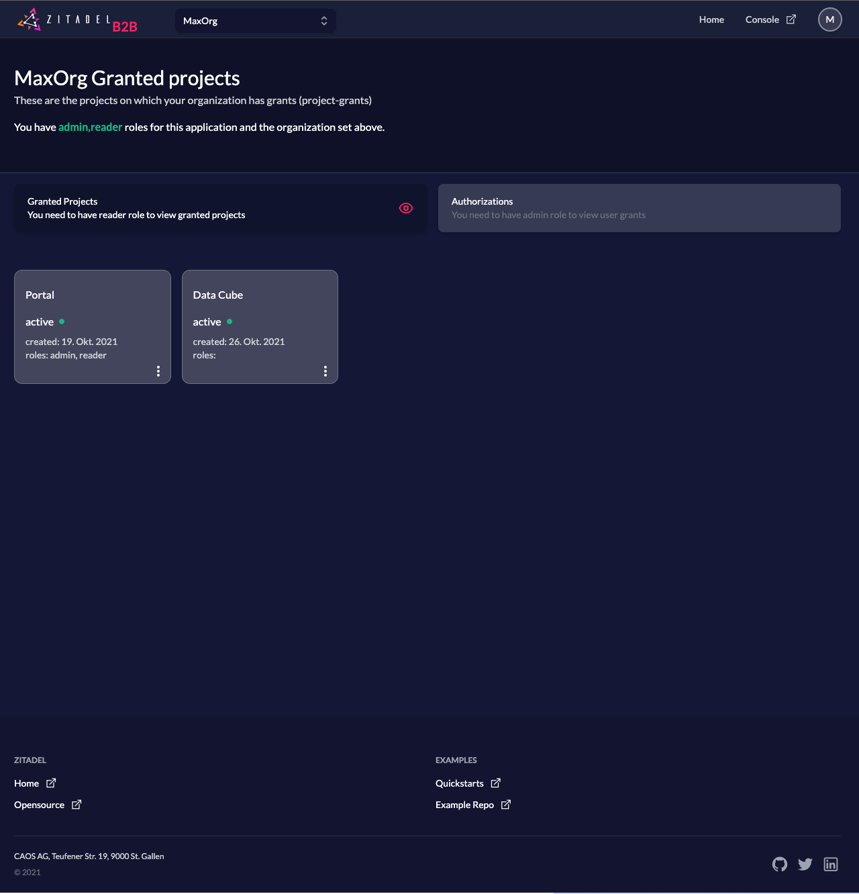

This is a demo showcasing how you can use ZITADEL in a B2B (Business-to-Business) context, where a company is providing a customer portal to their customers:

- A user of the customer should see all granted projects in the portal
- A admin user of the customers sees a list of customer's users (could be expanded to make roles editable)


## Getting Started

To run this sample locally you need to install dependencies first.

Type and execute:

```bash
yarn install
```

then, to run the development server:

```bash
npm run dev
# or
yarn dev
```

and open [http://localhost:3000](http://localhost:3000) with your browser to see the result.

## ZITADEL Setup

### Application Setup

To setup this sample you have to create a project and an application in your organization first.

Open [Console](https://console.zitadel.ch/projects) and create a new project. Let's call it `B2B-Demo`.
Then on the project detail page click on new application and enter a name for this app. Let's call this one `Portal`. Select `Web`, continue, `PKCE`, then enter `http://localhost:3000/api/auth/callback/zitadel` for the redirect, post redirect can be kept empty. Then press on `create`.

Copy the clientId as you will need this in your apps environment configuration file later.

On the application detail page open the collapsed section under redirect settings and enable `Development Mode`. This will allow you application to work on `localhost:3000`. Make sure to save your change.

### Secret

Now clone this project and navigate to its root folder. Create a file `.env.local` and copy paste the following:

```
NEXTAUTH_URL=http://localhost:3000
ZITADEL_CLIENT_ID=129954167266602411@portal
SERVICE_ACCOUNT_SECRET=
```

Take your previously copied clientId and paste it after `ZITADEL_CLIENT_ID=`.

### Service User

To make this application work you need a service user which loads granted-projects and user-grants for you.
Navigate to `Service-Users` in the side navigation panel of Console and create a new service-user.
Let's set its username to `nextjs` and its name to `NextJS`. Then press `create`.

On the detail page, add a new key, set an optional expiration date and download the generated JSON file.
Copy the content of this file right after `SERVICE_ACCOUNT_SECRET=` in your configuration file.

Back in Console, click onto the plus sign in the right sidepanel to grant access to your service user.
Select `owned project`, search for `B2B-Demo` and select `PROJECT_OWNER_VIEWER` as the Management role.

### Roles

To setup the needed roles for your project, navigate to your Portal project, and add the following roles

| Key    | Display Name  | Group | Description                                                            |
| :----- | :------------ | :---- | ---------------------------------------------------------------------- |
| admin  | Administrator |       | The administrator, allowed to read granted projects and to user grants |
| reader | Reader        |       | A user who is allowed to read his organizations granted projects only  |

Now make sure to enable `Assert Roles on Authentication` above the role table. This makes sure that roles are set in your OIDC ID Token which is used by the application to enable UI components.

## What does it do?:

Users with `view` role can view granted projects on their organization which were granted by your organization (owning this portal application).
Users with `admin` role can view granted projects and list users of the selected organization who are granted to use the portal application too.


